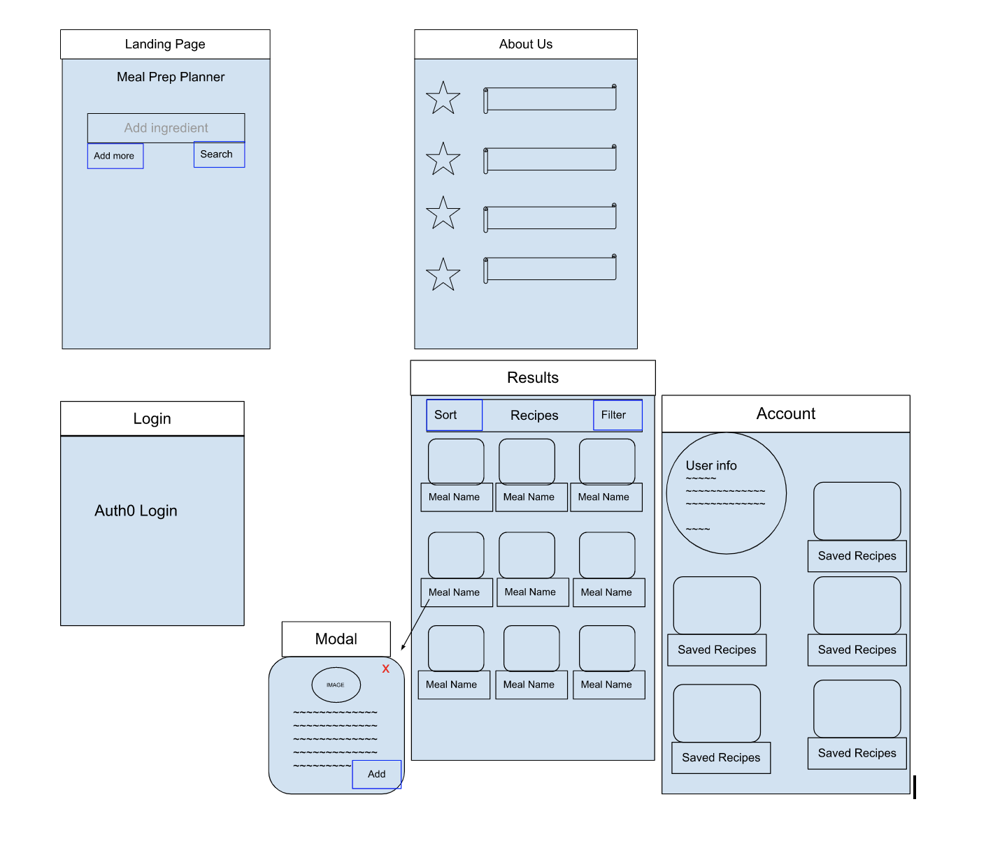
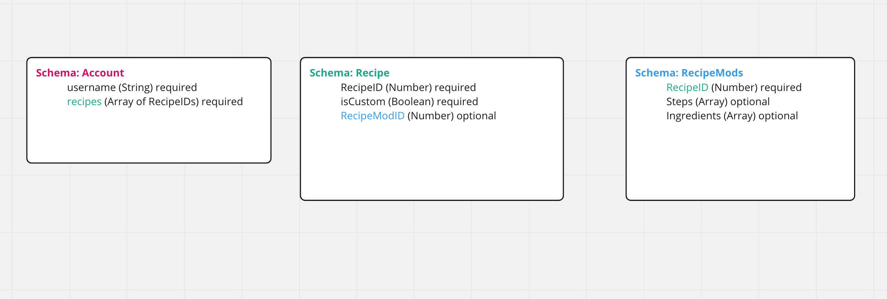

# GrubGuide Client
## Description

This app aims to help users with their meal planning by allowing them to search for recipes based off the ingredients that they possess. It also allows users to make changes to those recipes to fit their own personal needs.

**[Live site](https://lucky-fenglisu-5de387.netlify.app/)**

**Demo credentials:**

* email: test@test.com

* pw: Test123#

[Background image](https://unsplash.com/photos/wMzx2nBdeng) courtesy of Brooke Lark on Unsplash.

## User Stories

As someone new to cooking that doesn’t know what to make, I want to find recipes for ingredients I have.

As a gym rat, I want to be able to find recipes are easy, convenient, and quick to cook.

As someone with dietary restrictions, I want to be able to find recipes that are appropriate for me to eat.

As someone with not a lot of time, I want to be able to refer back to recipes at a later time.

As a home cook that likes experimenting, I want to be able to customize recipes and refer to them later.

## Whiteboards

## Features

* Recipe Search by Ingredients (currently up to 3)
* View Recipe Details
* Personal List of Saved Recipes
* Ability to Customize Saved Recipes

## Usage
* Log-in to GrubGuide through the provided demo credentials or create your own account.
  * If using a new account, input a username after being prompted.
* Add ingredients that you want to find recipes for.
* Click on a recipe to view details and click "Save Recipe" if you want to save it to your personal list.
* Click on "Hi <username>!" to view your personal recipe list.
* Click on the saved recipe to view details.
* Click on "Customize" to make changes to the recipe and save it as a "Custom Recipe".

## Installation (for your own version)
* Download or clone this repository.
* Run npm install to install dependencies.
* Have your API server running (see [meal-planner-server](https://github.com/Spoonacular-team-yellow/meal-planner-server) for more information).
* Add in your API Server and Auth0 information as depicted in .env.sample to your .env file.
* Use npm start to run the client.

## Collaborators

Joel Myrtil, Daniel Yoon, Ahmed Mohamed, Phillip Chaplin
